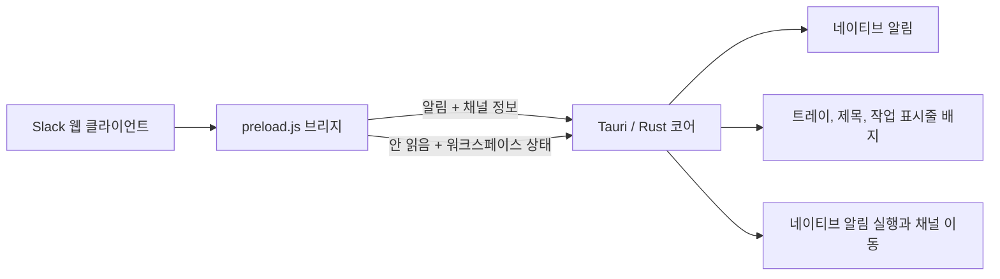

<p align="center">
  
</p>

<h1 align="center">Zlack</h1>

<p align="center">
  <strong>Tauri로 만든, 핵심에 집중한 Slack 데스크톱 클라이언트.</strong><br>
  전체 Chromium 번들 없이 네이티브 알림과 안정적인 창 복원,<br>
  빠른 멀티 워크스페이스 전환을 제공합니다.
</p>

<p align="center">
  <a href="https://github.com/sanguneo/zlack/releases"></a>
  <a href="https://github.com/sanguneo/zlack/blob/main/LICENSE"></a>
  
  
</p>

<p align="center">
  <a href="#why-zlack">주요 특징</a> ·
  <a href="#install">설치</a> ·
  <a href="#customize">사용자 지정</a> ·
  <a href="#development">개발</a> ·
  <a href="README.md">English</a>
</p>

---

<a id="why-zlack"></a>

## Zlack을 선택하는 이유

Zlack은 익숙한 Slack 웹 경험은 그대로 유지하면서 데스크톱 앱에 필요한
운영체제 연동, 정확한 알림 이동, 낮은 패키징 오버헤드를 더합니다.

|        | 기능                        | 설명                                                                                                                                             |
| ------ | --------------------------- | ------------------------------------------------------------------------------------------------------------------------------------------------ |
| **01** | 네이티브 알림               | Windows 토스트 알림 또는 macOS/Linux의 네이티브 알림 서비스로 Slack 알림을 전달합니다.                                                           |
| **02** | 네이티브 클릭 실행          | 알림이 생성된 워크스페이스를 복원하고 Slack에 클릭을 돌려줘 전체 페이지를 다시 불러오지 않고 DM이나 채널로 이동합니다.                           |
| **03** | 안 읽음 표시                | DM과 멘션은 빨간색, 그 외 안 읽은 활동은 파란색으로 표시하고 긴급 활동을 창 제목과 Windows 작업 표시줄에도 반영합니다.                           |
| **04** | 빠른 워크스페이스 전환      | 최대 두 워크스페이스를 준비 상태로 유지하고 Slack 계정 전환기에 버튼을 추가하며 <kbd>Ctrl</kbd> + <kbd>1</kbd>–<kbd>9</kbd> 단축키를 지원합니다. |
| **05** | 네이티브 기반의 가벼운 구조 | Electron/Chromium 전체를 포함하지 않고 Tauri와 운영체제 WebView를 사용합니다.                                                                    |
| **06** | 로컬 사용자 지정            | 실행 파일 옆의 CSS, 런타임 아이콘, 전용 WebView2 런타임을 선택적으로 불러옵니다.                                                                 |

<a id="install"></a>

## 설치

[GitHub Releases](https://github.com/sanguneo/zlack/releases/latest)에서
운영체제에 맞는 최신 패키지를 내려받아 설치한 뒤 Slack 워크스페이스에
로그인하세요.

| 플랫폼  | 패키지              | 런타임 참고                                          |
| ------- | ------------------- | ---------------------------------------------------- |
| Windows | `.exe`, `.msi`      | 공유 또는 전용 Microsoft Edge WebView2를 사용합니다. |
| macOS   | `.dmg`, `.app`      | 시스템 WebKit 웹뷰를 사용합니다.                     |
| Linux   | `.deb`, `.AppImage` | 시스템 WebKitGTK 스택을 사용합니다.                  |

> [!NOTE]
> 알림 클릭 실행은 플랫폼 알림 서비스의 클릭 액션 지원 여부에 따라 달라집니다.
> Windows에서는 패키징된 릴리스를 사용하면 개발 빌드의 AUMID 제약을 피할 수
> 있습니다.

<a id="customize"></a>

## 사용자 지정

다음 선택 파일을 `Zlack.exe` 또는 사용하는 플랫폼의 Zlack 실행 파일 옆에
배치하세요.

```text
Zlack
├── zlack.css          # Slack 클라이언트에 주입할 CSS
├── zlack.png          # 우선 사용하는 창·트레이 런타임 아이콘
├── zlack.ico          # 대체 런타임 아이콘
└── zlack-taskbar.png  # 선택 사항: Windows 작업 표시줄 전용 아이콘
```

애플리케이션과 설치 파일에 내장된 아이콘은 Zlack을 다시 빌드하기 전까지
변경되지 않습니다.

### Windows 전용 WebView2 런타임

기본 Windows 설치는 시스템 공유 WebView2 런타임을 사용합니다. Zlack을
공유 설치와 분리하려면 다음 순서로 설정하세요.

1. [Microsoft WebView2 페이지](https://developer.microsoft.com/microsoft-edge/webview2/)에서
   **Fixed Version** 런타임을 내려받습니다.
2. 압축을 풀어 `Zlack.exe` 옆에 `webview2-runtime` 디렉터리를 만듭니다.
3. `webview2-runtime/msedgewebview2.exe`가 존재하는지 확인합니다.

```text
Zlack.exe
└── webview2-runtime/
    ├── msedgewebview2.exe
    └── ...
```

`WEBVIEW2_BROWSER_EXECUTABLE_FOLDER`가 이미 설정되어 있지 않다면 전용
런타임을 우선 사용하고, 없으면 시스템 공유 런타임으로 대체합니다.

## 작동 방식



프리로드 브리지는 Slack의 알림 텔레메트리와 안 읽음 상태를 관찰하고,
필요한 정보만 Rust 코어에 전달합니다. 네이티브 계층은 알림 전송, 시스템
트레이, 워크스페이스 창, 창 포커스, 외부 링크 처리를 담당합니다.

### 보안 경계

- 원격 Tauri IPC는 Slack 도메인과 Zlack이 관리하는 워크스페이스 창으로
  범위를 제한합니다. 새 워크스페이스 창은 인증 정보가 없는 `slack.com`
  및 하위 도메인의 HTTPS URL만 허용합니다.
- Zlack의 외부 링크 명령은 인증 정보가 없는 HTTP(S) URL만 허용하고 파일
  및 사용자 지정 프로토콜을 거부합니다.
- 원격 Slack 페이지에는 Tauri의 범용 셸 권한과 내장 알림 API를 제공하지
  않습니다. 네이티브 알림은 Zlack의 제한된 알림 명령을 사용합니다.

<a id="development"></a>

## 개발

### 필수 환경

- [Node.js 18 이상](https://nodejs.org/)
- [Rust와 Cargo](https://rustup.rs/)
- [Tauri 1 시스템 요구사항](https://tauri.app/v1/guides/getting-started/prerequisites)

### 로컬 실행

```bash
npm install
npm run tauri dev
```

`pretauri` 훅은 각 Tauri 명령을 실행하기 전에 `package.json`의 버전을 Rust
및 Tauri 매니페스트에 동기화합니다.

### 배포 패키지 빌드

| 실행 환경 | 명령어                       | `dists/`에 복사되는 결과물 |
| --------- | ---------------------------- | -------------------------- |
| Windows   | `npm run build:dist:windows` | NSIS `.exe`, WiX `.msi`    |
| macOS     | `npm run build:dist:unix`    | `.dmg`, `.app`             |
| Linux     | `npm run build:dist:unix`    | `.deb`, `.AppImage`        |

### 프로젝트 구조

```text
src/
└── index.html              # 번들에 포함되는 대체 스플래시
src-tauri/
├── preload.js              # Slack과 Tauri를 연결하는 브리지
├── src/
│   ├── main.rs             # 앱 생명주기와 워크스페이스 제어
│   ├── icons.rs            # 런타임 및 안 읽음 배지 아이콘
│   ├── platform.rs         # 플랫폼별 알림·런타임 연동
│   └── security.rs         # URL 및 외부 링크 보안 경계
├── Cargo.toml
└── tauri.conf.json
scripts/
└── update-version.js       # 매니페스트 버전 동기화
```

## 기여

이슈와 목적이 분명한 풀 리퀘스트를 환영합니다. 동작 변경을 제안할 때는
대상 플랫폼과 현재 동작을 재현하는 절차를 함께 적어 주세요.

- [이슈 등록](https://github.com/sanguneo/zlack/issues)
- [변경 이력](CHANGELOG.md)

## 라이선스

Zlack은 [MIT 라이선스](LICENSE)로 배포됩니다.

Slack은 Salesforce, Inc.의 상표입니다. Zlack은 Slack 또는 Salesforce와
제휴하거나 이들의 보증을 받지 않은 독립 프로젝트입니다.
