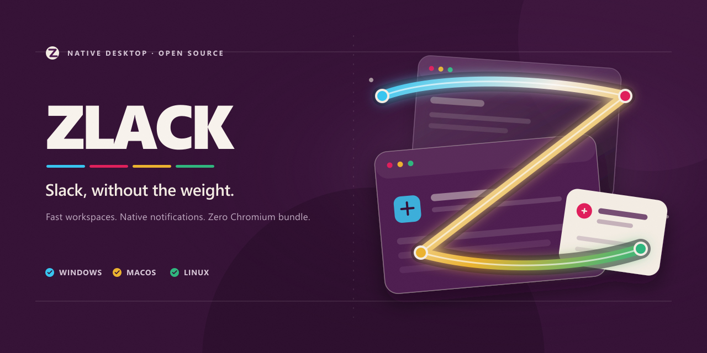
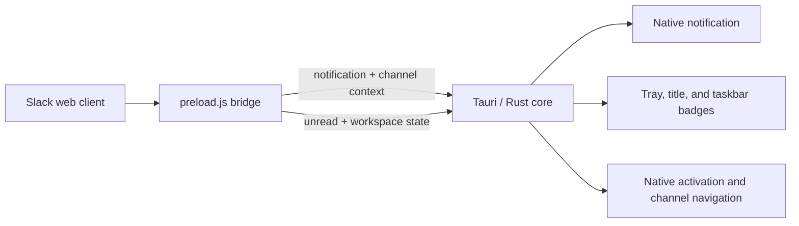

<p align="center">
  
</p>

<p align="center">
  
</p>

<h1 align="center">Zlack</h1>

<p align="center">
  <strong>A focused Slack desktop client powered by Tauri.</strong><br>
  Native notifications, reliable window restoration, and multi-workspace switching<br>
  without shipping a full Chromium bundle.
</p>

<p align="center">
  <a href="https://github.com/sanguneo/zlack/releases"></a>
  <a href="https://github.com/sanguneo/zlack/blob/main/LICENSE"></a>
  
  
</p>

<p align="center">
  <a href="#why-zlack">Why Zlack</a> ·
  <a href="#install">Install</a> ·
  <a href="#customize">Customize</a> ·
  <a href="#development">Development</a> ·
  <a href="README.ko.md">한국어</a>
</p>

---

## Why Zlack

Zlack keeps the familiar Slack web experience and adds the desktop behavior that
matters: native operating-system integration, dependable notification routing,
and low-overhead packaging through the system WebView.

|        | Capability               | What it does                                                                                                                                   |
| ------ | ------------------------ | ---------------------------------------------------------------------------------------------------------------------------------------------- |
| **01** | Native notifications     | Routes Slack alerts through Windows toast notifications or the native notification service on macOS/Linux.                                     |
| **02** | Native click activation  | Restores the originating workspace and hands the click back to Slack for in-app DM or channel routing without a full-page reload.              |
| **03** | Unread indicators        | Shows mentions and DMs in red, other unread activity in blue, and mirrors urgent activity in the window title and Windows taskbar.             |
| **04** | Fast workspace switching | Keeps up to two workspaces warm, adds workspace buttons to Slack's account switcher, and supports <kbd>Ctrl</kbd> + <kbd>1</kbd>–<kbd>9</kbd>. |
| **05** | Native footprint         | Uses Tauri and the operating system's WebView instead of bundling an entire Electron/Chromium runtime.                                         |
| **06** | Local customization      | Loads optional CSS, runtime icons, and a private WebView2 runtime from files beside the executable.                                            |

## Install

Download the latest package from
[GitHub Releases](https://github.com/sanguneo/zlack/releases/latest), install it,
then sign in to your Slack workspace.

| Platform | Packages            | Runtime note                                     |
| -------- | ------------------- | ------------------------------------------------ |
| Windows  | `.exe`, `.msi`      | Uses Microsoft Edge WebView2, shared or private. |
| macOS    | `.dmg`, `.app`      | Uses the system WebKit webview.                  |
| Linux    | `.deb`, `.AppImage` | Uses the system WebKitGTK stack.                 |

> [!NOTE]
> Notification-click activation depends on the platform notification service
> supporting click actions. On Windows, packaged releases avoid the AUMID
> restrictions that apply to development builds.

## Customize

Place any of these optional files beside `Zlack.exe` (or the Zlack executable on
your platform):

```text
Zlack
├── zlack.css          # CSS injected into the Slack client
├── zlack.png          # preferred runtime window and tray icon
├── zlack.ico          # fallback runtime icon
└── zlack-taskbar.png  # optional Windows taskbar-only icon
```

The embedded application and installer icons do not change until Zlack is
rebuilt.

### Private WebView2 runtime on Windows

The default Windows setup uses the shared system WebView2 runtime. To isolate
Zlack from that shared installation:

1. Download a **Fixed Version** runtime from
   [Microsoft's WebView2 page](https://developer.microsoft.com/microsoft-edge/webview2/).
2. Extract it into a `webview2-runtime` directory beside `Zlack.exe`.
3. Confirm that the executable exists at
   `webview2-runtime/msedgewebview2.exe`.

```text
Zlack.exe
└── webview2-runtime/
    ├── msedgewebview2.exe
    └── ...
```

Unless `WEBVIEW2_BROWSER_EXECUTABLE_FOLDER` is already set, Zlack uses the
private runtime when present and falls back to the shared runtime otherwise.

## How it works



The preload bridge observes Slack's notification telemetry and unread state,
then sends only the required context to the Rust core. The native layer owns
notification delivery, system tray behavior, workspace windows, window focus,
and external-link handling.

### Security boundaries

- Remote Tauri IPC is scoped to Slack domains and Zlack-managed workspace
  windows. New workspace windows accept only credential-free HTTPS URLs on
  `slack.com` and its subdomains.
- Zlack's external-link command accepts only credential-free HTTP(S) URLs and
  rejects file and custom protocols.
- The remote Slack page receives neither Tauri's general shell capability nor
  its built-in notification API. Native alerts use Zlack's narrow notification
  command instead.

## Development

### Requirements

- [Node.js 18 or newer](https://nodejs.org/)
- [Rust and Cargo](https://rustup.rs/)
- [Tauri 1 system prerequisites](https://tauri.app/v1/guides/getting-started/prerequisites)

### Run locally

```bash
npm install
npm run tauri dev
```

The `pretauri` hook synchronizes the version from `package.json` into the Rust
and Tauri manifests before each Tauri command.

### Build distributables

| Host    | Command                      | Output copied to `dists/` |
| ------- | ---------------------------- | ------------------------- |
| Windows | `npm run build:dist:windows` | NSIS `.exe`, WiX `.msi`   |
| macOS   | `npm run build:dist:unix`    | `.dmg`, `.app`            |
| Linux   | `npm run build:dist:unix`    | `.deb`, `.AppImage`       |

### Project map

```text
src/
└── index.html              # bundled fallback splash
src-tauri/
├── preload.js              # Slack-to-Tauri bridge
├── src/
│   ├── main.rs             # app lifecycle and workspace orchestration
│   ├── icons.rs            # runtime and unread badge icons
│   ├── platform.rs         # platform notification/runtime integration
│   └── security.rs         # URL and external-link boundaries
├── Cargo.toml
└── tauri.conf.json
scripts/
└── update-version.js       # manifest version synchronization
```

## Contributing

Issues and focused pull requests are welcome. For behavior changes, describe
the target platform and include steps that reproduce the current behavior.

- [Open an issue](https://github.com/sanguneo/zlack/issues)
- [Read the changelog](CHANGELOG.md)

## License

Zlack is available under the [MIT License](LICENSE).

Slack is a trademark of Salesforce, Inc. Zlack is an independent project and is
not affiliated with or endorsed by Slack or Salesforce.
